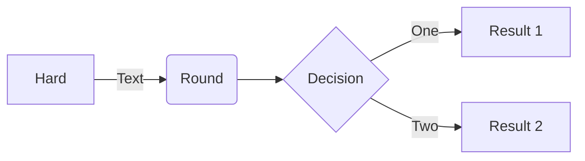

# data-science-workbooks
Repository to house data science related code. 
## Usage
This repo is configured with the [Dev Containers](https://marketplace.visualstudio.com/items?itemName=ms-vscode-remote.remote-containers) VS Code extension. To run locally pull the project down and run in a container. All dependencies are included in this process.
## Workbooks
### spark-machine-learning
Jupyter notebook demonstrating the process of producing a machine learning model in Spark. 
#### Purpose
Take super hero data to create a model that predicts a combat score based on other elements.
#### Source
Marvel Superheroes [Kaggle Dataset](https://www.kaggle.com/datasets/dannielr/marvel-superheroes?select=charcters_stats.csv)
#### Methods
Process included analyzing the data to determine best model for purpose and assist with feature selection. Data visualization to better understand data. Cleansing the dataset to prepare for model training. Model training using the Spark Random Forest Regression framework. Model evaluation using Sparks ML Evaluator functions.
## Dependencies
Managed in `.devcontainer/dependencies.sh`.
* Python
* PySpark
* Kaggle Cli
* Numpy
* Seaborn

